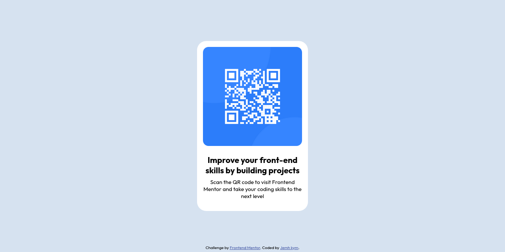

# Frontend Mentor - QR code component solution

This is a solution to the [QR code component challenge on Frontend Mentor](https://www.frontendmentor.io/challenges/qr-code-component-iux_sIO_H). Frontend Mentor challenges help you improve your coding skills by building realistic projects. 

## Table of contents

- [Overview](#overview)
  - [Screenshot](#screenshot)
  - [Links](#links)
- [My process](#my-process)
  - [Built with](#built-with)
- [Author](#author)

**Note: Delete this note and update the table of contents based on what sections you keep.**

## Overview

### Screenshot

### Links

- Solution URL: [Solution url on github](https://github.com/Mihiwa/Qr-code-component-main)
- Live Site URL: [Live site URL on Vercel](https://qr-code-component-main-beta-weld.vercel.app)

## My process

For the process I've started with HTML and finish with the CSS and there's no preprocessor just pure CSS

### Built with

- Semantic HTML5 markup
- CSS custom properties
- Flexbox

## Author

- Frontend Mentor - [@Mihiwa](https://www.frontendmentor.io/profile/Mihiwa)

